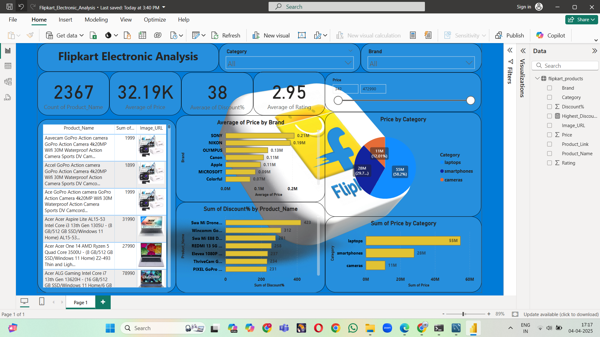
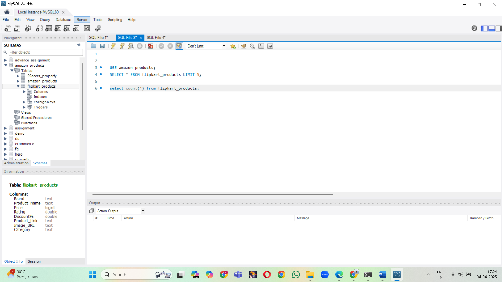

# 📦 Flipkart Electronics Product Analysis

This project performs end-to-end analysis of electronics sold on [Flipkart](https://www.flipkart.com/) using **Python**, **Power BI**, and **MySQL**.

We scraped real product data from Flipkart, cleaned and transformed it with Python, and built an interactive **Power BI dashboard** to uncover pricing trends, top brands, and discount patterns.

---

---

## 📊 Dashboard Snapshot

Explore the Power BI Dashboard 🎯  

[🔗 Download Dashboard (.pbix)](./Flipkart_Electronic_Analysis.pbix)

---

## 🔍 Objective

- Scrape real product listings from Flipkart's electronics section
- Analyze price ranges, ratings, and brand performance
- Store clean data into **MySQL**
- Visualize insights using **Power BI**

---

## 🛠 Tools Used

| Tool         | Purpose                     |
|--------------|-----------------------------|
| Python       | Web scraping & cleaning     |
| Selenium     | Dynamic page scraping       |
| BeautifulSoup| HTML parsing                |
| Pandas       | Data transformation         |
| MySQL        | Data storage                |
| Power BI     | Dashboard & visualization   |

---

## 📁 Files Included

| File                          | Description                                |
|-------------------------------|--------------------------------------------|
| `New_flipkart.ipynb`          | Web scraping + cleaning notebook           |
| `flipkart_products.xls`       | Raw scraped data                           |
| `flipkart_cleaned_data.xls`   | Cleaned, transformed dataset               |
| `Flipkart_Electronic_Analysis.pbix` | Power BI dashboard file          |
| `powerbi_dashboard.png`       | Power BI dashboard screenshot              |
| `powerbi_transform.png`       | Power BI data transformation preview       |
| `sql.sql`                     | SQL table creation script                  |

---

## ⚙️ Workflow Overview

1. **Web Scraping**: Collected data from Flipkart using Selenium + BeautifulSoup  
2. **Data Cleaning**: Removed noise, extracted brand names, formatted prices & ratings  
3. **Data Storage**: Loaded clean data into a MySQL table  
4. **Visualization**: Power BI used for Cards, Slicers, filters, charts, and trend analysis

---

## 🧠 Key Insights from Dashboard

- 📈 **Top Brands** by average rating and price
- 💰 **Price distribution** across categories
- ⭐ **Product ratings** and discount patterns
- 🔍 **Filters** to explore by brand, price, and category

📄 Full report also available as [PDF](./Flipkart_Electronic_Analysis.pdf)

---

## 📷 Additional Visuals

| SQL Workflow | Data Transform |
|--------------|----------------|
|  |  |

---

